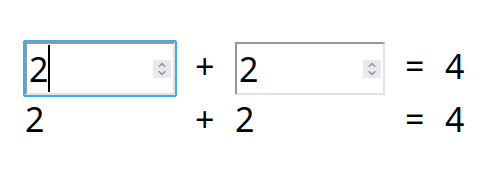

# Bind

> _This simple proof of concept shows how to create a binding between object and template was created for learning purposes._

## Description

File `bind.js` exports one function that takes a template id in html and an object, then return proxy and a function to remove event handlers.

The binding works with `data-bind` attribute values, that should be equals object property.

The template will be updated when the inputs values change or object properties change.

Proxy accessible from the browser console, and you can experiment with it.
